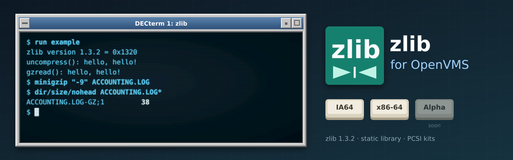

<p align="center">
  
</p>

# zlib for OpenVMS

[](https://github.com/issinoho/vms-zlib/releases)

The [zlib](https://zlib.net) compression library (**1.3.2**) built natively for OpenVMS on **IA64**
and **x86-64**, following zlib's own releases rather than any vendor's release cycle. Its first user
is [curl for OpenVMS](https://github.com/issinoho/vms-curl), which links it statically for
compressed transfers. It belongs to the same family as
[GNU grep](https://github.com/issinoho/vms-grep), [GNU sed](https://github.com/issinoho/vms-sed),
[GNU awk](https://github.com/issinoho/vms-awk), [GNU make](https://github.com/issinoho/vms-make),
[GNU diffutils](https://github.com/issinoho/vms-diffutils),
[GNU patch](https://github.com/issinoho/vms-patch), [GNU m4](https://github.com/issinoho/vms-m4),
[GNU Bison](https://github.com/issinoho/vms-bison), [flex](https://github.com/issinoho/vms-flex),
[GNU Wget](https://github.com/issinoho/vms-wget), [curl](https://github.com/issinoho/vms-curl),
[PCRE2](https://github.com/issinoho/vms-pcre2), [bzip2](https://github.com/issinoho/vms-bzip2),
[XZ Utils](https://github.com/issinoho/vms-xz), [Zstandard](https://github.com/issinoho/vms-zstd)
and [MariaDB](https://github.com/issinoho/vms-mariadb) for OpenVMS.

zlib ships its own OpenVMS build procedure (`make_vms.com`) in the release tarball. This
repository builds with it and holds **only our changes**: every build starts from the signed
release tarball (Mark Adler's key, pinned in `keys/`), applies our patches and adds our VMS
files in `vmsport/`.

## Status

| | IA64 (OpenVMS V8.4-2L3, VSI C 7.4) | x86-64 (OpenVMS E9.2-4, VSI C 7.7) |
|---|---|---|
| Builds with upstream's `make_vms.com` | yes | yes |
| Smoke test (zlib's `example` self-test, `minigzip` round trip) | 2/2 | 2/2 |
| Clang (LP64) build for programs compiled with clang (`BUILD ALL CLANG`) | n/a | builds; smoke test 2/2 |
| PCSI kit ([v1.3.2-vms1](https://github.com/issinoho/vms-zlib/releases/tag/v1.3.2-vms1)) | `ISSINOHO-I64VMS-ZLIB-V0103-2E1-1.PCSI` | `ISSINOHO-X86VMS-ZLIB-V0103-2E1-1.PCSI` |

## Installing the kit

Download the kit for your architecture from the
[latest release](https://github.com/issinoho/vms-zlib/releases/latest) and check it against
the release's `SHA256SUMS`. A kit downloaded through a non-VMS system loses its record
format, so restore that first, then install it:

```
$ SET FILE/ATTRIBUTE=(RFM:FIX,LRL:8192,MRS:8192,RAT:NONE) ISSINOHO-*-ZLIB-V0103-2E1-1.PCSI
$ PRODUCT INSTALL ZLIB /PRODUCER=ISSINOHO /SOURCE=dev:[dir]
```

It installs `ZLIB.H`, `ZCONF.H`, `LIBZ.OLB` and `MINIGZIP.EXE` under `[ZLIB]`, the
documentation in `[ZLIB.DOC]`, and `SYS$STARTUP:ZLIB$STARTUP.COM`, which defines `ZLIB$ROOT`
(add `$ @SYS$STARTUP:ZLIB$STARTUP.COM` to `SYS$MANAGER:SYSTARTUP_VMS.COM` to define it at
every boot). Build against it with `/INCLUDE=ZLIB$ROOT:[INCLUDE]` and
`ZLIB$ROOT:[LIB]LIBZ.OLB/LIBRARY`; any `/NAMES` setting works (patch 0003).
`PRODUCT REMOVE ZLIB` removes it and deassigns `ZLIB$ROOT`. The kit's version
`V1.3-2E1` is zlib 1.3.2 with our patch level as the ECO.

## What gets built

- **`LIBZ.OLB`:** the library as an object library, for static linking.
- **A PCSI kit** (`[.KIT_<arch>]`) that installs the library, headers and `minigzip`.
- **An install tree** `[.INSTALL_<arch>]` with `[.INCLUDE]ZLIB.H, ZCONF.H` and
  `[.LIB]LIBZ.OLB`. Define the rooted logical name `ZLIB$ROOT` for it, then compile with
  `/INCLUDE=ZLIB$ROOT:[INCLUDE]` and link with `ZLIB$ROOT:[LIB]LIBZ.OLB/LIBRARY`.
- `EXAMPLE.EXE` and `MINIGZIP.EXE`, zlib's test programs, and upstream's shared image
  `LIBZSHR.EXE`.

**Clang (LP64) build (x86-64):** VSI C is ILP32 (`long` and pointers 32-bit) and VSI's
clang is LP64, so objects from the two cannot be mixed, and zlib's `uLong` and `z_stream`
differ between them. `@[.VMSPORT]BUILD ALL CLANG` (or `tools/build.sh x86 ALL CLANG`) runs
the normal build, then compiles the library sources again with clang, against the same
configured `zconf.h`, into `[.OBJ_X86_64_CLANG]` and the install tree
`[.INSTALL_X86_64_CLANG]`. Its first user is [PHP for OpenVMS](https://github.com/issinoho/vms-php)
(as vms-pcre2's clang tree serves [MariaDB](https://github.com/issinoho/vms-mariadb)).
`tools/test.sh x86 CLANG` runs the smoke test against the clang-built `example` and
`minigzip`: 2/2.

## Patches

| Patch | Purpose |
|---|---|
| 0001 | `gzguts.h`: don't define `_POSIX_C_SOURCE` on VMS. Defined after `<stdio.h>`, it makes the CRTL's `<fcntl.h>` redeclare `creat()` incompatibly, and the `gz*.c` files did not compile. |
| 0002 | `make_vms.com`: recognise OpenVMS x86-64. It took the architecture from `HW_MODEL`, which put x86-64 in the VAX range: objects were compiled without `/NAMES=AS_IS` and the shared image options file was rejected. |
| 0003 | `zlib.h`: declare the API with `#pragma names as_is` on VMS, so programs compiled with the default `/NAMES=UPPERCASE` link with the `AS_IS` library. |

All three apply to upstream's VMS support and could go back to zlib.

## How to build

```sh
git clone https://github.com/issinoho/vms-zlib.git
cd vms-zlib
tools/prepare.sh            # fetch + verify the release, apply patches, add vmsport/
tools/build.sh ia64         # upload, then @[.VMSPORT]BUILD on the node (upstream's make_vms.com)
tools/test.sh ia64          # smoke test
```

By hand on VMS: copy the top-level files of `staging/zlib-1.3.2/` and its `vmsport/` and
`test/` directories, then `@[.VMSPORT]BUILD` and `@[.VMSPORT]TEST_SMOKE`. Set up
`tools/nodes.conf` as described in
[vms-grep's README](https://github.com/issinoho/vms-grep#2b-build-on-vms-from-the-host-over-ssh).

## Roadmap

1. ~~curl for OpenVMS links this library statically~~: done in
   [vms-curl v8.22.0-vms1](https://github.com/issinoho/vms-curl/releases/tag/v8.22.0-vms1);
   [vms-wget](https://github.com/issinoho/vms-wget) links it too.
2. Patches 0001-0003 offered to zlib.
3. A port to OpenVMS **Alpha**.

The family of ports, all for IA64 and x86-64 (MariaDB: x86-64 only), each following its upstream releases:

| Port | Latest release | |
|---|---|---|
| GNU grep — [vms-grep](https://github.com/issinoho/vms-grep) | [v3.12-vms3](https://github.com/issinoho/vms-grep/releases/tag/v3.12-vms3) | with `grep -P` through PCRE2 |
| PCRE2 — [vms-pcre2](https://github.com/issinoho/vms-pcre2) | [v10.49-vms1](https://github.com/issinoho/vms-pcre2/releases/tag/v10.49-vms1) | the regular-expression library |
| GNU sed — [vms-sed](https://github.com/issinoho/vms-sed) | [v4.10-vms1](https://github.com/issinoho/vms-sed/releases/tag/v4.10-vms1) | the stream editor |
| GNU awk (gawk) — [vms-awk](https://github.com/issinoho/vms-awk) | [v5.4.1-vms1](https://github.com/issinoho/vms-awk/releases/tag/v5.4.1-vms1) | built with gawk's own VMS port |
| **zlib** (this port) — [vms-zlib](https://github.com/issinoho/vms-zlib) | [v1.3.2-vms1](https://github.com/issinoho/vms-zlib/releases/tag/v1.3.2-vms1) | the compression library |
| bzip2 — [vms-bzip2](https://github.com/issinoho/vms-bzip2) | [v1.0.8-vms1](https://github.com/issinoho/vms-bzip2/releases/tag/v1.0.8-vms1) | the bzip2 compressor and libbz2 |
| XZ Utils — [vms-xz](https://github.com/issinoho/vms-xz) | [v5.8.4-vms1](https://github.com/issinoho/vms-xz/releases/tag/v5.8.4-vms1) | xz and liblzma |
| Zstandard — [vms-zstd](https://github.com/issinoho/vms-zstd) | [v1.5.7-vms1](https://github.com/issinoho/vms-zstd/releases/tag/v1.5.7-vms1) | zstd and libzstd |
| curl — [vms-curl](https://github.com/issinoho/vms-curl) | [v8.22.0-vms2](https://github.com/issinoho/vms-curl/releases/tag/v8.22.0-vms2) | alongside VSI's curl kit, following curl's own releases |
| GNU Wget — [vms-wget](https://github.com/issinoho/vms-wget) | [v1.25.0-vms2](https://github.com/issinoho/vms-wget/releases/tag/v1.25.0-vms2) | the web retriever |
| GNU m4 — [vms-m4](https://github.com/issinoho/vms-m4) | [v1.4.21-vms1](https://github.com/issinoho/vms-m4/releases/tag/v1.4.21-vms1) | the macro processor |
| GNU Bison — [vms-bison](https://github.com/issinoho/vms-bison) | [v3.8.2-vms2](https://github.com/issinoho/vms-bison/releases/tag/v3.8.2-vms2) | the parser generator; runs GNU m4 |
| flex — [vms-flex](https://github.com/issinoho/vms-flex) | [v2.6.4-vms1](https://github.com/issinoho/vms-flex/releases/tag/v2.6.4-vms1) | the scanner generator; runs GNU m4 |
| GNU make — [vms-make](https://github.com/issinoho/vms-make) | [v4.4.1-vms1](https://github.com/issinoho/vms-make/releases/tag/v4.4.1-vms1) | built with make's own VMS port |
| GNU diffutils — [vms-diffutils](https://github.com/issinoho/vms-diffutils) | [v3.12-vms1](https://github.com/issinoho/vms-diffutils/releases/tag/v3.12-vms1) | cmp, diff, diff3, sdiff |
| GNU patch — [vms-patch](https://github.com/issinoho/vms-patch) | [v2.8-vms1](https://github.com/issinoho/vms-patch/releases/tag/v2.8-vms1) | applies diffs |
| MariaDB — [vms-mariadb](https://github.com/issinoho/vms-mariadb) | [v11.4.13-vms1](https://github.com/issinoho/vms-mariadb/releases/tag/v11.4.13-vms1) | server and clients; x86-64 only, preview |

## Artwork

`docs/images/banner.svg` and `docs/images/icon.svg` were made for this project in the style
of classic DECwindows and VT terminals, like those of its sibling ports. The "zlib" mark in
them is our own drawing, not an official zlib logo.

## Licence

zlib is distributed under the zlib licence; see `COPYING`, a copy of upstream's `LICENSE`.
Our patches and VMS build files are distributed under the same terms.

OpenVMS is a trademark of VMS Software, Inc. This project is not affiliated with VMS
Software, Inc. or with the zlib project.
